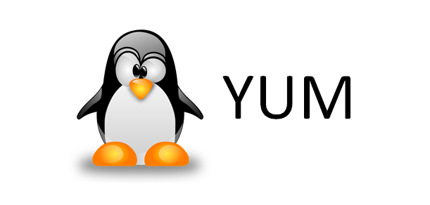

# Reducing build times with Multi Stage builds and yum caching

As a Build Engineer I'm always looking for ways to make builds faster, reduce dependencies, reduce waste and increase resilience. 

This is just a quick example of re-using a local cache of yum packages during build time. 

This will also work for Advanced Package Tool (apt) and Alpine Package Manager (apk).

## Benefits

- Reduces build time
- Offline installs
- Less bandwidth used 
- Better protection against network "flaps" at build time

## Create a cache image

Create a container image that contains a cache of yum packages. 

This command will create a container image which is Alpine based and includes the Centos7 Development Tools and dependencies.

```
docker build -t devtools:latest -f Dockerfile.createcache .
```

## Build developer environment without using the cache

The following command will build a container image which downloads and installs the Centos7 Development Tools and dependencies.

```
time docker build -t devenv:latest -f Dockerfile.dev_env .
```

This will take a few minutes to download and install the Centos7 Development Tools and dependencies.


## Build developer environment using the cache

Uncomment lines 6 and 10 and run :

```
time docker build -t devenv:latest -f Dockerfile.dev_env .
```

This build will re-use the packages cached in the devtools:latest image so you should see a much faster build time. 


# Summary 

There are lot's of little use cases (and some big) for Multi Stage builds in Docker 17.05 and this is just one of them.

@tomwillfixit @shipitcon
